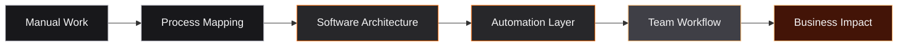

<!--
Profile README for Mauricio Camargo
File name on GitHub must be: README.md
-->

<div align="center">


<br />


<br />

<a href="https://www.linkedin.com/in/mauriciocamargo-dev">
  
</a>
<a href="mailto:camargopaterninamauricio@gmail.com">
  
</a>


</div>

---

<table>
<tr>
<td width="58%" valign="top">

## `whoami`

I'm **Mauricio Camargo**, a software developer focused on building systems that help businesses organize conversations, operations, data, and workflows.

I work on private client systems, internal tools, automation platforms, CRM workflows, dashboards, and API integrations.

My focus is simple:

```txt
business problem → software system → automation → measurable impact
```

I prefer building practical software that real teams can use every day.

</td>
<td width="42%" valign="top">

## `current_mode`

```txt
Building:
  - business software
  - AI automation
  - CRM workflows
  - internal tools
  - API integrations

Mindset:
  - product thinking
  - clean architecture
  - operational impact
  - secure deployments
```

</td>
</tr>
</table>

---

<div align="center">

## What I build

</div>

<table>
<tr>
<td align="center" width="25%">
<h3>🧩 Internal Tools</h3>
<p>Custom platforms for teams that need to replace spreadsheets, manual work, and disconnected processes.</p>
</td>
<td align="center" width="25%">
<h3>🤖 AI Automation</h3>
<p>AI-assisted workflows that reduce repetitive tasks and help teams work faster with better context.</p>
</td>
<td align="center" width="25%">
<h3>💬 CRM Systems</h3>
<p>Conversation-driven workflows, notes, contact context, messaging operations, and team collaboration.</p>
</td>
<td align="center" width="25%">
<h3>🔌 Integrations</h3>
<p>APIs, webhooks, databases, dashboards, and system-to-system automation for business operations.</p>
</td>
</tr>
</table>

---

## Tech Stack

<div align="center">

### Frontend


### Backend


### Infrastructure & Tools


### Product & Automation


</div>

---

## System thinking



---

## Private work, public direction

Most of the systems I build are private, client-facing, or internal business tools, so I do not publicly expose sensitive repositories, operational data, client workflows, credentials, infrastructure details, or proprietary implementations.

What I can share publicly is my direction:

<table>
<tr>
<td width="50%" valign="top">

### Business Software

Systems designed around real operational needs:

- internal platforms
- workflow tools
- dashboards
- user management
- document flows
- reporting
- team productivity

</td>
<td width="50%" valign="top">

### Automation Architecture

Automation that connects tools and processes:

- API integrations
- webhooks
- AI-assisted workflows
- message-driven processes
- data synchronization
- operational alerts

</td>
</tr>
</table>

---

## Engineering principles

> Good software should feel like leverage.

I care about software that is:

- **useful before flashy**
- **secure before public**
- **reliable before complex**
- **clear before clever**
- **designed around actual workflows**
- **built to reduce operational noise**
- **simple enough for teams to adopt**

---

## Areas of expertise

<div align="center">

`Full-Stack Development` · `Business Software Architecture` · `AI Automation` · `CRM Workflows`  
`Internal Tools` · `Operational Dashboards` · `API Integrations` · `Webhooks`  
`Messaging Systems` · `PostgreSQL` · `Docker` · `Workflow Automation` · `Product Thinking`

</div>

---

## GitHub activity

<div align="center">


</div>

<div align="center">


</div>

---

<div align="center">

## Let's build systems that move businesses forward.

I build private, practical, and scalable software for business operations, automation, and internal workflows.

<br />

<a href="mailto:camargopaterninamauricio@gmail.com">
  
</a>

<br /><br />


</div>
