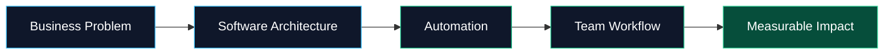

<!--
Profile README for Mauricio Camargo
File name on GitHub must be: README.md
-->

<div align="center">


<br />


<br />

<a href="https://www.linkedin.com/in/mauriciocamargo-dev">
  
</a>
<a href="mailto:camargopaterninamauricio@gmail.com">
  
</a>


</div>

---

<table>
<tr>
<td width="56%" valign="top">

## 👋 About me

I'm **Mauricio Camargo**, a software developer focused on building tools for real business operations.

I work at the intersection of:

- **Business software**
- **WhatsApp CRM systems**
- **AI automation**
- **Internal tools**
- **Operational dashboards**
- **API integrations**
- **Self-hosted SaaS architecture**

I like building software that is not just technically interesting, but actually useful for teams that need to move faster, reduce manual work, and keep control of their operations.

</td>
<td width="44%" valign="top">

## 🚀 Current focus

### Xat CRM

A WhatsApp-first CRM platform for teams that manage conversations, candidates, customers, onboarding, support, and operations through messaging.

**Core ideas:**

```txt
Conversation → Context → Workflow → Automation
```

Built around real operational needs, not generic templates.

</td>
</tr>
</table>

---

<div align="center">

## 🧠 What I build

</div>

<table>
<tr>
<td align="center" width="25%">
<h3>💬 WhatsApp CRM</h3>
<p>Multi-inbox messaging, contacts, notes, history, teams, and automation-ready workflows.</p>
</td>
<td align="center" width="25%">
<h3>🤖 AI Workflows</h3>
<p>AI-assisted systems that reduce repetitive work and help teams make faster decisions.</p>
</td>
<td align="center" width="25%">
<h3>🧩 Internal Tools</h3>
<p>Custom business software for operations, onboarding, recruitment, dashboards, and tracking.</p>
</td>
<td align="center" width="25%">
<h3>🔌 API Systems</h3>
<p>Integrations, webhooks, data flows, and self-hosted infrastructure for scalable products.</p>
</td>
</tr>
</table>

---

## 🛠️ Tech Stack

<div align="center">

### Frontend


### Backend


### Infrastructure & Tools


### Automation & Product


</div>

---

## 🧭 Product Direction



I care about software that makes business operations clearer, faster, and easier to manage.

---

## 🧱 Featured Work

<table>
<tr>
<td width="50%" valign="top">

### 💬 Xat CRM

A WhatsApp-first CRM built for teams that need structured conversations, notes, historical context, and automation-ready workflows.

**Focus areas:**

- WhatsApp conversations
- Internal notes
- Contact matching
- Public API and webhooks
- Realtime updates
- Operational messaging
- Self-hosted deployment architecture

</td>
<td width="50%" valign="top">

### 🧑‍💼 Staffing Operations Platform

Internal software for recruitment, onboarding, candidate communication, and operational tracking.

**Focus areas:**

- Candidate pipeline
- Onboarding workflows
- WhatsApp communication
- Historical context
- Internal dashboards
- Recruiter workflows
- Document and status tracking

</td>
</tr>
</table>

---

## ⚡ How I think about software

> Good software should feel like leverage.

I believe strong business software should be:

- **Useful before flashy**
- **Reliable before complex**
- **Simple enough for teams to adopt**
- **Flexible enough for real workflows**
- **Clear enough that people know what to do next**
- **Built around operations, not assumptions**

---

## 📌 Areas of Expertise

<div align="center">

`Business Software Architecture` · `WhatsApp CRM` · `AI Automation` · `Internal Tools` · `Full-Stack Development`  
`Operational Dashboards` · `API Integrations` · `Webhooks` · `Recruitment Systems` · `Onboarding Workflows`  
`Self-Hosted SaaS` · `Docker Deployments` · `Workflow Automation` · `Product Thinking`

</div>

---

## 📊 GitHub Activity

<div align="center">


</div>

<div align="center">


</div>

---

<div align="center">

## Let's build systems that move businesses forward.

If you are building, scaling, or modernizing operations through software, AI, or WhatsApp-based workflows, feel free to connect.

<br />

<a href="mailto:camargopaterninamauricio@gmail.com">
  
</a>

<br /><br />


</div>
