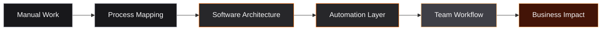

<!--
Profile README for Mauricio Camargo
File name on GitHub must be: README.md
-->

<div align="center">

<h1>Software Developer & AI Automation Builder</h1>

<h3>Business Systems • CRM Workflows • Internal Tools • API Integrations</h3>

<p>
I build software for real business operations — from manual processes to scalable digital workflows.
</p>

<a href="https://www.linkedin.com/in/mauriciocamargo-dev">
  
</a>
<a href="mailto:camargopaterninamauricio@gmail.com">
  
</a>


<br /><br />

</div>

---

<table>
<tr>
<td width="58%" valign="top">

## About

I'm a software developer focused on building systems that help businesses organize conversations, operations, data, and workflows.

I work on private client systems, internal tools, automation platforms, CRM workflows, dashboards, and API integrations.

My focus is simple:

```txt
business problem → software system → automation → measurable impact
```

I prefer building practical software that real teams can use every day.

</td>
<td width="42%" valign="top">

## Current Focus

```txt
Building:
  - business software
  - AI automation
  - CRM workflows
  - internal tools
  - API integrations

Mindset:
  - product thinking
  - clean architecture
  - operational impact
  - secure deployments
```

</td>
</tr>
</table>

---

<div align="center">

## What I Build

</div>

<table>
<tr>
<td align="center" width="25%">
<h3>Internal Tools</h3>
<p>Custom platforms for teams that need to replace spreadsheets, manual work, and disconnected processes.</p>
</td>
<td align="center" width="25%">
<h3>AI Automation</h3>
<p>AI-assisted workflows that reduce repetitive tasks and help teams work faster with better context.</p>
</td>
<td align="center" width="25%">
<h3>CRM Systems</h3>
<p>Conversation-driven workflows, notes, contact context, messaging operations, and team collaboration.</p>
</td>
<td align="center" width="25%">
<h3>Integrations</h3>
<p>APIs, webhooks, databases, dashboards, and system-to-system automation for business operations.</p>
</td>
</tr>
</table>

---

## Tech Stack

<div align="center">

### Frontend


### Backend


### Infrastructure & Tools


### Product & Automation


</div>

---

## How I Think About Systems



---

## Private Work, Public Direction

Most of the systems I build are private, client-facing, or internal business tools, so I do not publicly expose sensitive repositories, operational data, client workflows, credentials, infrastructure details, or proprietary implementations.

What I can share publicly is my direction:

<table>
<tr>
<td width="50%" valign="top">

### Business Software

Systems designed around real operational needs:

- internal platforms
- workflow tools
- dashboards
- user management
- document flows
- reporting
- team productivity

</td>
<td width="50%" valign="top">

### Automation Architecture

Automation that connects tools and processes:

- API integrations
- webhooks
- AI-assisted workflows
- message-driven processes
- data synchronization
- operational alerts

</td>
</tr>
</table>

---

## Engineering Principles

> Good software should feel like leverage.

I care about software that is:

- **useful before flashy**
- **secure before public**
- **reli
